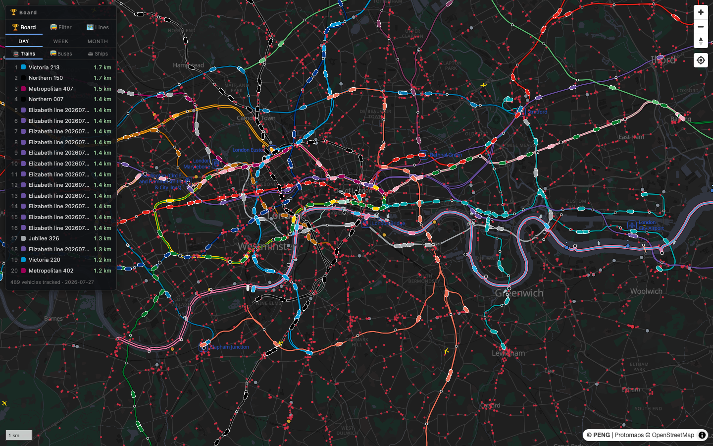
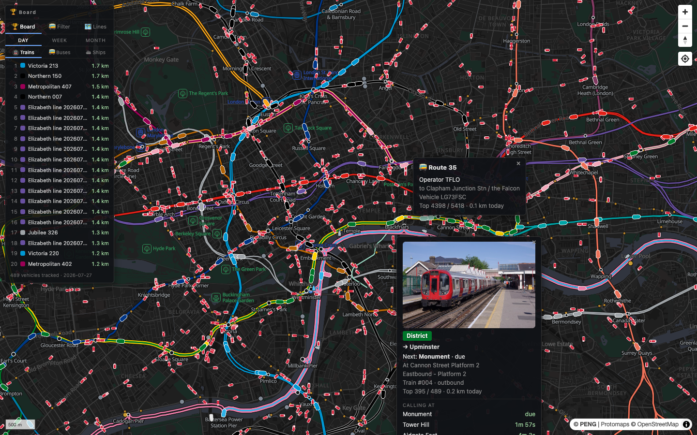
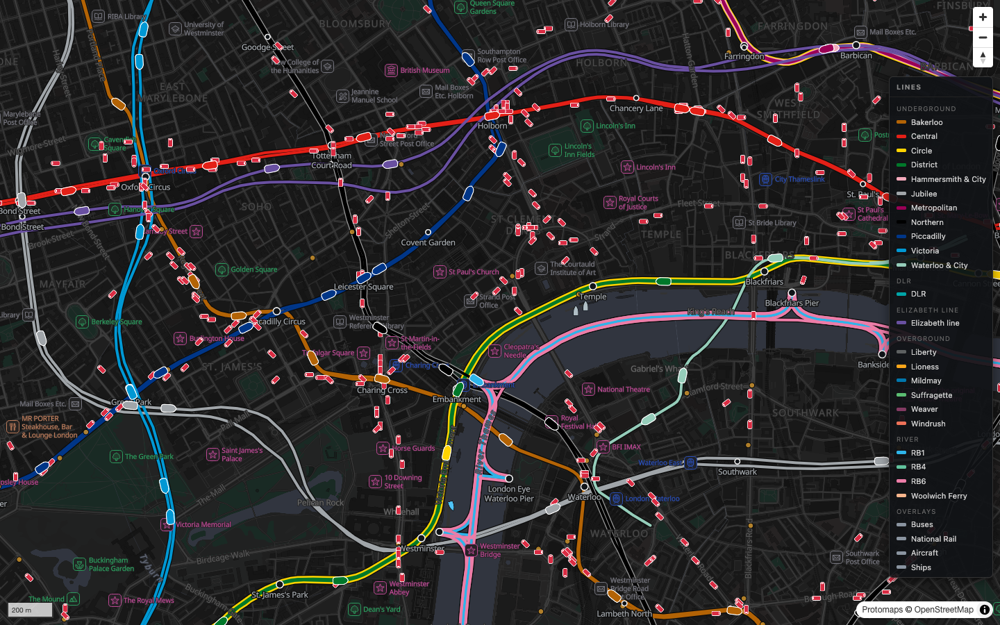
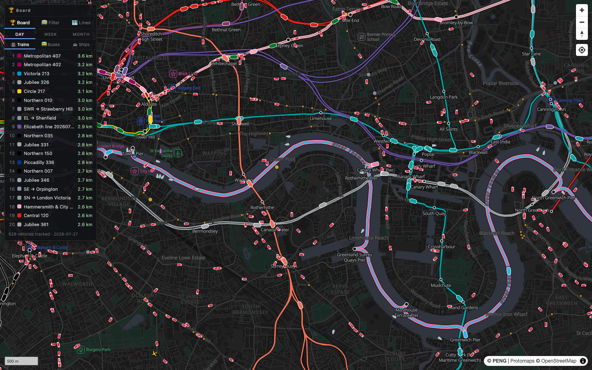

# London Live — 2D Real-Time Transport Map

**Every train, bus, boat, ship, plane and helicopter over London — live, on one map.**

### 🌍 Live demo: [london-live.up.railway.app](https://london-live.up.railway.app)



Inspired by [Zone One](https://london.jamespotter.dev/), rebuilt in 2D at
Greater-London scale. Author: **PENG**.

## What's on the map

| Layer | Source | How positions are derived |
|---|---|---|
| 🚇 Tube · DLR · Overground · Elizabeth (19 lines) | TfL Unified API | No GPS in the feed — positions **inferred from arrival countdowns**, scheduled inter-station run times, and animated along real OSM track geometry |
| 🚆 National Rail (431 stations) | Darwin via Rail Data Marketplace | Inferred from departure boards + calling points, pathed over a baked station-to-station rail graph |
| 🚌 Buses (~6,700 live) | DfT Bus Open Data (SIRI-VM) | Real GPS + per-vehicle α-β-style tracker; **self-learning route geometry** snaps buses to their true paths (auto-retrains daily from collected traces) |
| ⛴ Riverboats (RB1/RB4/RB6/Woolwich Ferry) | TfL | Countdown inference along the OSM Thames centreline, with curved pier approaches |
| ⚓ Ships | AIS (aisstream.io) | Real positions; typed icons (cargo/tanker/passenger/tug); detail cards show dimensions, flag and a photo — ship photographs courtesy of [VesselFinder](https://www.vesselfinder.com), fetched per-MMSI |
| ✈️ Aircraft & helicopters | ADS-B (airplanes.live) | Real positions, dead-reckoned between polls; click for route lookup and an airframe photo via [Planespotters.net](https://www.planespotters.net) (with photographer attribution) |
| 📷 JamCams (878 traffic cameras) | TfL | Click for a live still, auto-refreshing |

Train detail cards also show a representative photo of the line's rolling stock,
bundled from [Wikimedia Commons](https://commons.wikimedia.org) (CC-licensed —
sources, licenses and authors in [docs/PHOTO_CREDITS.md](docs/PHOTO_CREDITS.md)).



## Interactions

- **Hover** any vehicle, station or line for a quick tooltip (shared corridors list every line).
- **Click** vehicles for detail cards that follow them: destination, next stop countdown,
  calling pattern, platform, delay reason, vessel name/speed for boats.
- **Click** stations for live departure boards + zone, facilities, crowding, lift alerts
  and nearby cycle-hire docks.
- **Legend** toggles every line and overlay.




## Engineering highlights

- **Dirty-data hardening** for TfL's countdown feed: stale-"due" handoff, countdown-regression
  absorption (94 regressions observed in a 2-minute probe), monotonic track-space interpolation,
  branch hysteresis, coasting through feed flicker with destination-aware release.
- **All geometry is real**: tube tracks, rail corridors and the Thames centreline are stitched
  from OpenStreetMap; buses learn their routes from their own GPS traces (timetable shapes as prior,
  stop-anchored trimmed-mean averaging, quality-gated).
- **Polite API consumption**: batching + caching + per-upstream rate budgets keep TfL usage
  around 1% of the free allowance; all keys stay server-side.

## Running locally

```bash
# 1. basemap (~136 MB, not committed)
pmtiles extract https://build.protomaps.com/20260721.pmtiles data/london.pmtiles \
  --bbox=-0.55,51.25,0.35,51.72

# 2. keys — copy backend/.env.example to backend/.env and fill in:
#    TFL_APP_KEY (api-portal.tfl.gov.uk)      — required
#    AIS_API_KEY (aisstream.io)               — optional: ships
#    DARWIN_TOKEN (raildata.org.uk LDB key)   — optional: National Rail
#    BODS_API_KEY (data.bus-data.dft.gov.uk)  — optional: buses

# 3. run
cd backend && npm install && npm start        # :3000
cd frontend && npm install && npm run dev     # :5173

# 4. (one-off) bake static data if regenerating from scratch
node scripts/bake-routes.mjs && node scripts/bake-osm-geometry.mjs \
  && node scripts/bake-runtimes.mjs && node scripts/bake-nr-graph.mjs
```

## Layout

`frontend/` Vite + TypeScript + MapLibre GL · `backend/` Fastify proxies, pollers and the
self-scheduling bus-route learner · `scripts/` data baking (TfL, OSM, timetables, NR graph) ·
`data/` baked geometry (committed) + basemap/traces (not committed) · `docs/` architecture,
implementation plan, roadmap.
