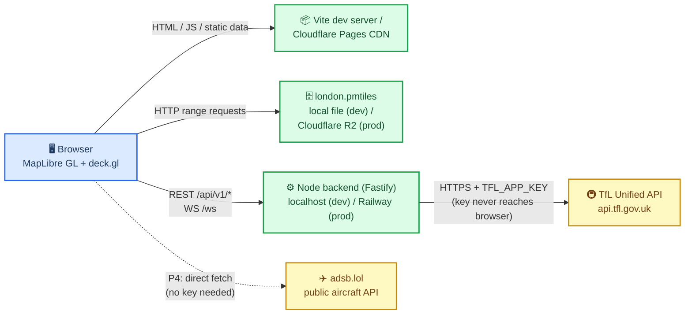
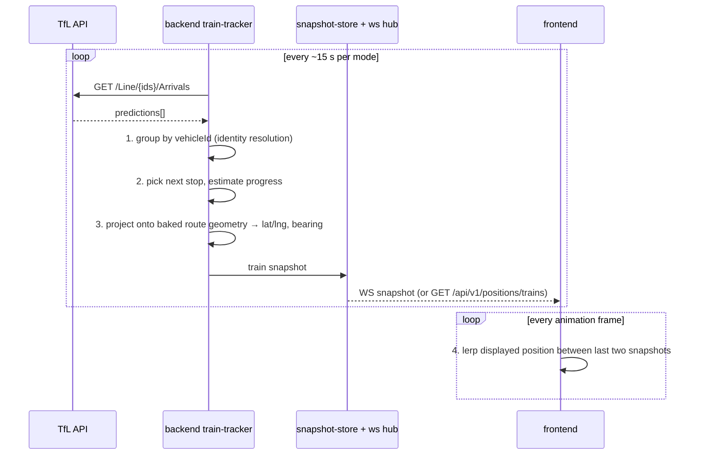

# london-live-2d — Architecture

A 2D real-time map of London's public transport: tube/DLR/Overground/Elizabeth line trains,
all ~9,000 buses, and (stretch) aircraft over London. Inspired by Zone One
(london.jamespotter.dev), but flat 2D and covering all of Greater London.

**Confirmed stack (not up for debate):** MapLibre GL JS + Vite frontend (TypeScript),
Protomaps `.pmtiles` London extract as basemap, Node.js/TypeScript backend that proxies the
TfL Unified API and later broadcasts vehicle snapshots over WebSocket, deck.gl overlay for
high-count layers. Deploy: Cloudflare Pages (frontend + pmtiles on R2) and Railway (backend).
Everything runs locally first: backend on one port, Vite dev server proxying `/api` and `/ws`.

---

## 🗺️ System Context



Key boundary decisions:

- **The TfL app key lives only in the backend** (`TFL_APP_KEY` env var). The browser never
  talks to `api.tfl.gov.uk` directly.
- **pmtiles is fetched directly by the browser** via HTTP range requests — it never touches
  the backend. In dev it is served by Vite from `public/tiles/`; in prod from R2 behind the
  Pages CDN.
- **adsb.lol is keyless and CORS-friendly**, so the aircraft layer (P4) calls it straight
  from the browser — no backend involvement, no rate budget impact.

---

## 📁 Repository Layout

Single repo, npm workspaces, TypeScript everywhere:

```
london-live-2d/
├── frontend/          # Vite + MapLibre + deck.gl app
├── backend/           # Fastify server (proxy, aggregator, WS)
├── scripts/           # one-shot data-baking scripts (run locally, output committed)
├── data/              # baked static JSON (routes.json, stations.json) — checked in
├── shared/            # types shared by frontend + backend (WS envelope, snapshot shapes)
└── docs/              # this document, ADRs
```

---

## ⚙️ Backend

### Framework choice: Fastify

Fastify over Express because: first-class TypeScript support, JSON-schema request/response
validation built in, `@fastify/websocket` gives WS on the same port/server without a second
listener, and plugin encapsulation maps cleanly onto the module layout below. Express would
also work; Fastify simply removes glue code we would otherwise write (typed config, schema
validation, WS integration).

### Module layout

```
backend/src/
├── server.ts                  # bootstrap: build app, listen on PORT
├── app.ts                     # register plugins/routes; exported for tests (inject())
├── config.ts                  # typed env parsing (zod), fail-fast at startup
├── plugins/
│   ├── tfl-client.ts          # thin fetch wrapper: base URL, app_key param, timeouts, retry
│   ├── cache.ts               # in-memory TTL cache (Map) — no Redis until proven needed
│   └── rate-budget.ts         # token bucket for outbound TfL calls (see below)
├── routes/
│   ├── health.ts              # GET /healthz — liveness + budget/cache stats
│   ├── tfl-proxy.ts           # GET /api/v1/tfl/* — allowlisted, cached passthrough
│   ├── positions.ts           # GET /api/v1/positions/trains — computed train positions
│   └── static-data.ts         # GET /api/v1/data/{routes,stations} — serves data/*.json
├── ws/
│   ├── hub.ts                 # connection registry; broadcast(payload) to all sockets
│   └── broadcaster.ts         # serializes snapshots once, fans out; heartbeat ping
├── aggregate/
│   ├── train-tracker.ts       # P2: arrivals → inferred train positions (pipeline below)
│   ├── bus-poller.ts          # P3: rolling poll of ~700 bus routes
│   └── snapshot-store.ts      # latest snapshot per domain; source for REST + WS
└── domain/
    ├── route-geometry.ts      # loads data/routes.json; project distance→lat/lng along line
    └── types.ts               # re-exports from shared/
```

### TfL proxy (`/api/v1/tfl/*`)

- **Allowlist, not open proxy**: only path prefixes we use (`/Line/`, `/StopPoint/`,
  `/Mode/`) are forwarded; anything else is 404. Prevents the deployment becoming a free
  TfL key for the internet.
- **Cache-aside** per URL with per-prefix TTLs: arrivals 10 s, line status 60 s, route
  sequences 24 h. With N browsers polling the same endpoint, the backend makes ~1 upstream
  call per TTL window regardless of client count.
- Responses pass through unmodified (same JSON), plus `x-cache: hit|miss` for debugging.

### Rate-limit budgeting (`rate-budget.ts`)

The TfL key allows ~500 req/min. One token bucket guards all outbound calls, split into
reserved lanes so a burst in one consumer cannot starve another:

| Lane | Budget (req/min) | Consumer |
| ------------------ | ---------------: | -------------------------------------- |
| `bus-aggregation`  | 350 | P3 bus poller (~700 routes / 2-min cycle) |
| `train-tracking`   | 60 | P2 train arrivals polling |
| `proxy-passthrough`| 60 | cache misses from `/api/v1/tfl/*` |
| headroom           | 30 | retries, baking scripts run manually |

On lane exhaustion: proxy requests return the stale cached value (with `x-cache: stale`)
or 429; the aggregation loops simply stretch their cycle time. On upstream 429, exponential
backoff with jitter and a temporary global budget reduction.

### Snapshot broadcaster

Aggregation loops write into `snapshot-store.ts`; the broadcaster pushes on a fixed cadence:

- Full-state snapshots (not diffs) every cycle — simple, self-healing, no client sync state.
- Serialize each snapshot **once** to a string, then write to every socket (fan-out is a
  memory copy, not N serializations).
- On client connect: send the latest stored snapshots immediately, so the map is populated
  before the next broadcast tick.
- Heartbeat ping every 30 s; drop dead sockets.

### Configuration (env vars, validated in `config.ts`)

| Variable | Default | Purpose |
| ----------------------- | ----------------------- | ------------------------------------ |
| `TFL_APP_KEY` | — (required) | TfL Unified API key |
| `PORT` | `8787` | HTTP + WS listen port |
| `HOST` | `0.0.0.0` | bind address (Railway needs 0.0.0.0) |
| `CORS_ORIGIN` | `http://localhost:5173` | allowed origin in prod |
| `TFL_BASE_URL` | `https://api.tfl.gov.uk`| override for tests/mocks |
| `SNAPSHOT_INTERVAL_MS` | `5000` | WS broadcast cadence |
| `BUS_POLL_ENABLED` | `false` | feature flag for the P3 loop |
| `LOG_LEVEL` | `info` | pino level |

Missing/invalid required vars abort startup with a clear message. `.env` (git-ignored) +
`.env.example` (committed) in `backend/`.

---

## 🖥️ Frontend

```
frontend/src/
├── main.ts                    # entry: init map, register layers, start services
├── config.ts                  # API base URL, WS URL, poll intervals (from import.meta.env)
├── map/
│   ├── create-map.ts          # MapLibre init: pmtiles protocol, London bounds, style
│   ├── style.ts               # basemap style JSON (Protomaps light/dark flavors)
│   └── deck-overlay.ts        # single MapboxOverlay instance shared by deck.gl layers
├── layers/
│   ├── lines-layer.ts         # static route geometries from data/routes.json (GeoJSON source)
│   ├── stations-layer.ts      # station dots + labels from data/stations.json
│   ├── trains-layer.ts        # ~600 points — deck.gl ScatterplotLayer + interpolation
│   ├── buses-layer.ts         # ~9,000 points — deck.gl layer, position interpolation
│   └── aircraft-layer.ts      # P4: adsb.lol polled client-side
├── services/
│   ├── api-client.ts          # typed fetch wrapper for /api/v1/* (shared/ types)
│   ├── poll-service.ts        # generic setInterval poller w/ visibility pause (P1/P2)
│   ├── ws-client.ts           # WebSocket wrapper: reconnect w/ exp backoff + jitter,
│   │                          #   envelope parsing, falls back to poll-service if WS down
│   └── snapshot-buffer.ts     # keeps last two snapshots per domain for interpolation
├── animation/
│   └── interpolator.ts        # per-frame lerp of displayed positions between snapshots
└── ui/
    ├── layer-toggle.ts        # show/hide layers
    └── status-bar.ts          # connection state, data age, vehicle counts
```

Notes:

- **Dev proxy**: `vite.config.ts` proxies `/api` → `http://localhost:8787` and `/ws` →
  same with `ws: true`. Frontend code only ever uses relative URLs, so dev and prod
  (Pages → Railway, absolute URL injected via `VITE_API_BASE_URL`) share one code path.
- **MapLibre vs deck.gl split**: basemap, static line geometries, and station labels are
  native MapLibre layers (cheap, label collision handled). Anything that moves every frame
  (trains, buses, aircraft) is deck.gl via one `MapboxOverlay` — a single WebGL context,
  updated by replacing layer `data` arrays.
- **Progressive delivery**: P1 lines + status polling, P2 trains, P3 buses over WS,
  P4 aircraft. `ws-client.ts` degrades to REST polling if the socket cannot connect, so
  P1/P2 features never depend on WS availability.

---

## 🚆 Train-Position Inference Pipeline

TfL has no position feed for trains — only arrival *predictions*. Positions are inferred.
**All inference runs on the backend** (steps 1–3); the frontend does only step 4
(cosmetic interpolation of already-computed positions).



1. **Arrivals polling** — `/Line/{comma-separated-ids}/Arrivals` per mode (tube, dlr,
   overground, elizabeth-line), batched to stay inside the `train-tracking` lane.
2. **Identity resolution** — group predictions by `vehicleId` (falling back to
   `lineId + direction + destination` clustering where `vehicleId` is unreliable, e.g. some
   Overground services). Each group = one train, with an ordered list of upcoming stops and
   `timeToStation` values. Track trains across polls in a keyed map; expire after 3 missed polls.
3. **Position projection** — from the next stop and `timeToStation`, estimate fractional
   progress along the inter-station segment (assume constant segment travel time from the
   baked geometry's segment lengths; clamp to [0, 1]). Convert distance-along-line to
   lat/lng + bearing using `route-geometry.ts` (linear referencing over `data/routes.json`
   polylines). Output per train: `{ id, lineId, lat, lng, bearing, nextStopId, state }`.
4. **Client-side smoothing** — the frontend never re-derives positions. It keeps the last
   two snapshots and, each animation frame, lerps each vehicle's *displayed* position toward
   its latest snapshot position over the snapshot interval. New vehicles fade in; vehicles
   missing from the latest snapshot fade out. Result: smooth motion at 60 fps from 5–15 s data.

Buses (P3) skip steps 2–3: TfL bus arrivals carry usable per-vehicle data and the same
projection approach applies per route, computed in `bus-poller.ts` on the same store/broadcast path.

---

## 🧁 Data Baking Pipeline (`scripts/` → `data/`)

Static reference data is baked **offline by one-shot scripts** and the JSON output is
**committed to the repo** — the runtime never depends on these TfL endpoints being up, and
the frontend can import the files as static assets (served by Vite/Pages, cacheable forever).

```
scripts/
├── bake-routes.ts       # → data/routes.json
├── bake-stations.ts     # → data/stations.json
└── lib/tfl.ts           # shared fetch helper (reads TFL_APP_KEY from env), polite delays
```

`npm run bake` (needs `TFL_APP_KEY` locally):

1. `GET /Line/Mode/tube,dlr,overground,elizabeth-line` → list of line ids, names, colors.
2. For each line and direction: `GET /Line/{id}/Route/Sequence/{inbound|outbound}` →
   `lineStrings` (route polylines) + ordered `stopPointSequences`.
3. `GET /StopPoint/{ids}` (batched) → station names, coordinates, served lines, interchanges.
4. Post-process: dedupe shared geometry, precompute cumulative segment lengths (so runtime
   linear referencing is a lookup, not a computation), attach official line colors.

Output shapes (defined in `shared/`):

- `data/routes.json` — `{ lines: [{ id, name, color, branches: [{ direction, coords:
  [[lng,lat],…], cumulativeM: [0,…], stops: [stopId,…] }] }] }`
- `data/stations.json` — `{ stations: [{ id, name, lat, lng, lines: [lineId,…],
  isInterchange }] }`

Re-run manually when TfL changes routes (rare); diffs are reviewable in git. Scripts throttle
themselves (~1 req/s) — they share the key but run outside the server's budget, so bake while
the prod poller is off or accept temporary lane shrinkage.

---

## 🔌 API Surface

### REST (all under `/api/v1`, JSON)

| Endpoint | Purpose | Cache |
| ------------------------------------ | --------------------------------------------- | ----------- |
| `GET /healthz` | liveness, budget + cache + WS stats | none |
| `GET /api/v1/data/routes` | baked routes.json | immutable |
| `GET /api/v1/data/stations` | baked stations.json | immutable |
| `GET /api/v1/tfl/line/:ids/status` | proxied line status (allowlisted passthrough) | 60 s |
| `GET /api/v1/tfl/line/:ids/arrivals` | proxied arrivals | 10 s |
| `GET /api/v1/positions/trains` | latest computed train snapshot (WS fallback) | snapshot age|
| `GET /api/v1/positions/buses` | latest bus snapshot (P3, WS fallback) | snapshot age|

Errors use one envelope: `{ "error": { "code": "upstream_rate_limited", "message": "…" } }`
with appropriate HTTP status. Baked-data endpoints exist so the frontend has a single origin
for data in prod, but the files may also ship in the frontend bundle — either path works.

### WebSocket (`/ws`)

Versioned envelope on every message (types in `shared/ws-messages.ts`):

```jsonc
{ "v": 1, "type": "trains", "ts": 1789000000000, "data": { "vehicles": [ /* … */ ] } }
```

| Type | Direction | Payload |
| --------------- | --------------- | ------------------------------------------------ |
| `hello` | server → client | `{ serverTime, snapshotIntervalMs, domains }` |
| `trains` | server → client | full train snapshot |
| `buses` | server → client | full bus snapshot (P3) |
| `line-status` | server → client | line status changes |
| `ping` / `pong` | both | heartbeat |

Rules: clients ignore unknown `type`s; `v` bumps only on breaking changes (old clients then
reconnect and hard-reload); full snapshots mean a missed message costs nothing.

---

## ⚠️ Key Risks and Mitigations

| Risk | Impact | Mitigation |
| --- | --- | --- |
| **TfL 500 req/min key limit** — ~700 bus routes is the whole budget | Throttled key, dead map | Server-side aggregation is the *only* consumer of arrivals at scale (clients never multiply upstream calls); token-bucket lanes with headroom; batch line ids per request; stretch poll cycle under pressure; serve stale cache instead of re-fetching; backoff on 429 |
| **WS fan-out cost** — ~9,000 buses × many clients | Backend CPU/bandwidth | Serialize once per broadcast; compact payloads (short keys, coords rounded to 5 dp, ints for bearings); full snapshots keep server stateless per client; if needed later: per-domain subscription messages, then viewport filtering — both fit the envelope without version bump |
| **pmtiles size** — a London extract can reach hundreds of MB | Slow first load, R2 egress | pmtiles is range-request native: browsers fetch only needed tiles, never the whole file; trim extract to Greater London bbox + needed zooms/layers at bake time; serve via R2 through Cloudflare CDN (cached, zero egress fee); keep the big file out of git (download script for dev) |
| **Train positions are inferred, not measured** | Trains visibly wrong | Clamp progress to segments; snap to baked geometry (never off-track); expire stale vehicles; label the layer "estimated" in UI |
| **`vehicleId` unreliability on some modes** | Duplicate/jumping trains | Fallback clustering key (line + direction + destination + time ordering); prefer stability over completeness — drop ambiguous groups rather than render ghosts |
| **TfL API outage** | Empty map | Cache-serving degrades gracefully; status bar shows data age; static layers (lines, stations, basemap) always work |
| **Free-tier limits (Railway/Pages)** | Sleep/cold starts | Single lightweight Node process, in-memory state only (rebuilds within one poll cycle after restart); no database to manage |

---

## 🚀 Delivery Phases

| Phase | Scope | New moving parts |
| ----- | ----- | ---------------- |
| P1 | Basemap + baked lines/stations + line status via proxy polling | Fastify proxy, cache, baking scripts |
| P2 | Train position inference, REST polling of `/positions/trains` | train-tracker, route-geometry, interpolator |
| P3 | Bus aggregation loop + WS broadcast for buses and trains | rate-budget lanes, bus-poller, ws hub/broadcaster |
| P4 | Aircraft layer (client-side adsb.lol), polish | aircraft-layer only |

Each phase is independently shippable; WS arrives only in P3, and everything before it works
on plain REST polling — which also remains the permanent fallback path.
